# aws-cfront-route53-s3-reactjs-initproj 🐳


[](https://github.com/tquangdo/aws-cfront-route53-s3-reactjs-initproj/issues/new)

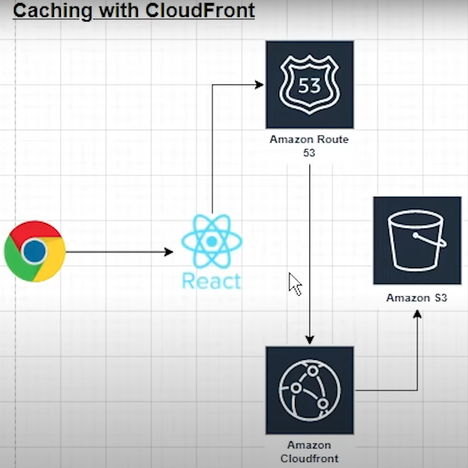

## reference
[youtube](https://www.youtube.com/watch?v=mls8tiiI3uc)

## s3
+ create 2 buckets `dtqsimplified.io` & `www.dtqsimplified.io`
### `www.dtqsimplified.io`
+ upload all reactjs files & folders in `build` (after `npm run build`)
```shell
# aws s3 ls s3://www.dtqsimplified.io/
                           PRE static/
2022-01-02 17:36:25        605 asset-manifest.json
2022-01-02 17:36:26       3870 favicon.ico
2022-01-02 17:36:26        644 index.html
2022-01-02 17:36:27       5347 logo192.png
2022-01-02 17:36:28       9664 logo512.png
2022-01-02 17:36:28        492 manifest.json
2022-01-02 17:36:29         67 robots.txt
```
+ make bucket public with policy
```json
{
    "Version": "2012-10-17",
    "Statement": [
        {
            "Sid": "Statement1",
            "Effect": "Allow",
            "Principal": "*",
            "Action": [
                "s3:GetObject"
            ],
            "Resource": [
                "arn:aws:s3:::www.dtqsimplified.io/*"
            ]
        }
    ]
}
```
+ enable `static website hosting`
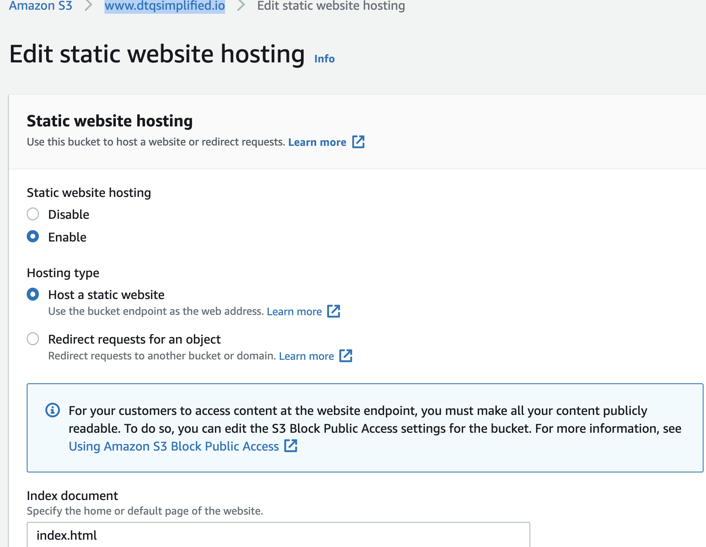
### `dtqsimplified.io`
+ enable `static website hosting`
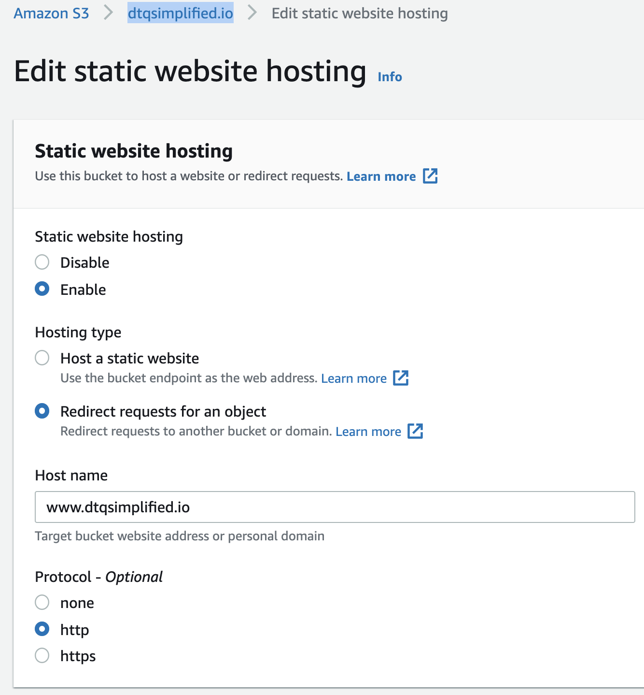
+ because we chose `redirect request for an object`, so if we click in `Bucket website endpoint` there will be redirected to `http://www.dtqsimplified.io/`

## route53
+ `registered domains` > create `dtqsimplified.io` (💣💣)
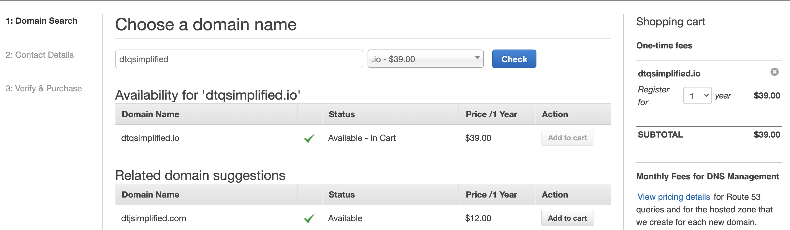
+ in `hosted zones` create `dtqsimplified.io`
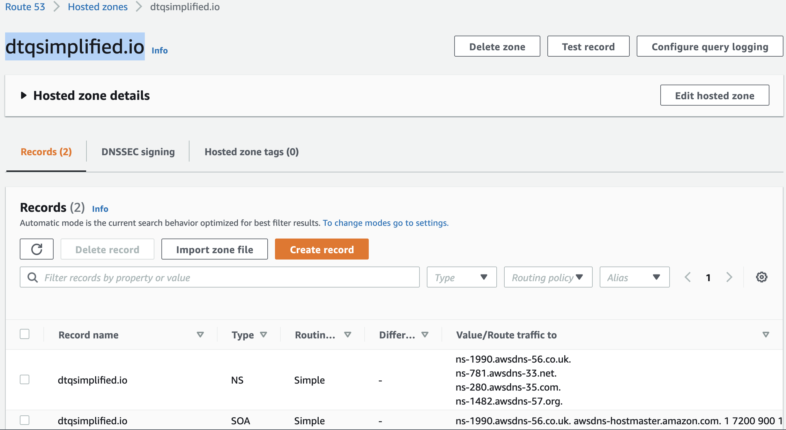
+ click `create record` > routing policy= `simple routing` > `define simple record`
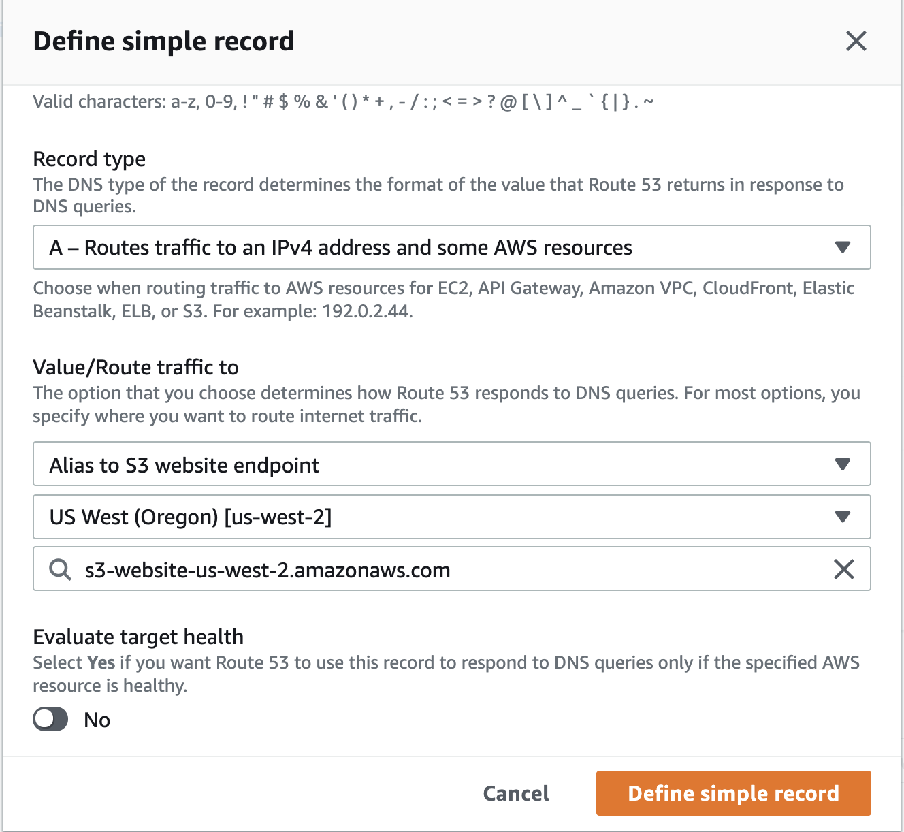
+ create 2 records & result:
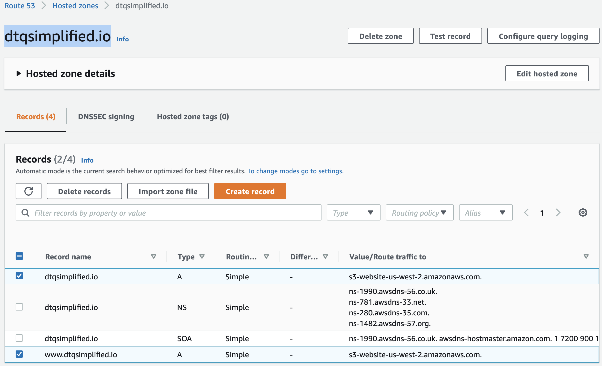
+ access `dtqsimplified.io` on browser (💣💣)
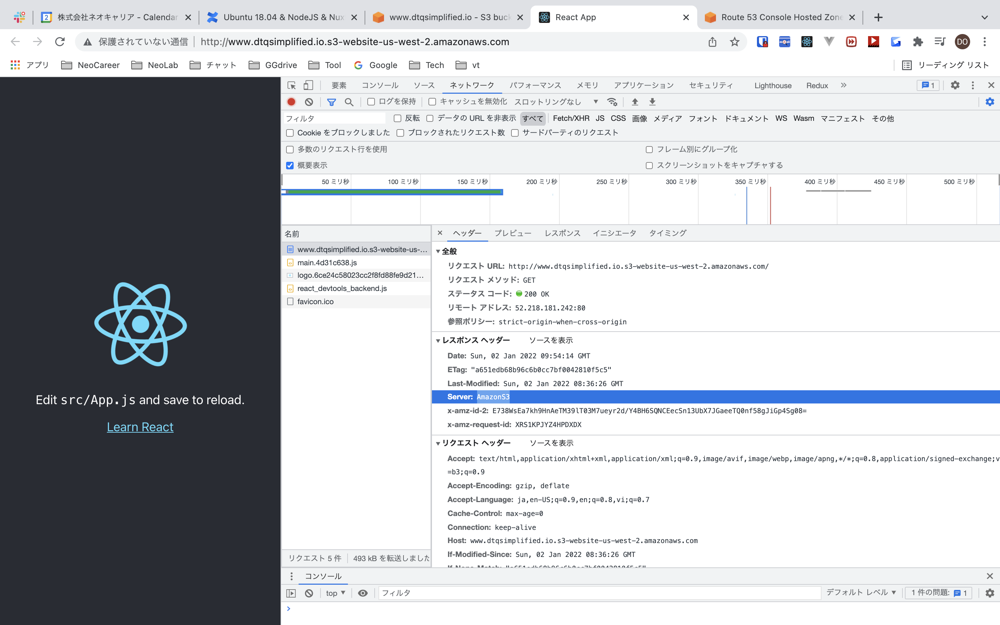

## ACM (US East (N. Virginia) Region (us-east-1))
+ request 2 public certs for `www.dtqsimplified.io` & `dtqsimplified.io` (💣💣)
+ click `create records in Route53`
> status=`issued` with condition `registered domains` is OK!!!
+
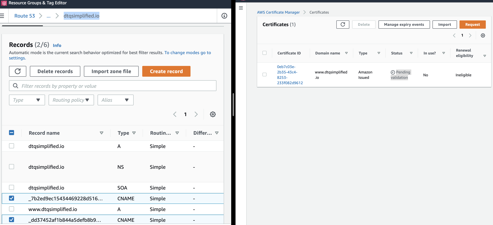

## cfront
+ create 2 distributions for `www.dtqsimplified.io` & `dtqsimplified.io`
1. origin domain = `www.dtqsimplified.io.s3-website-us-west-2.amazonaws.com`
2. Viewer protocol policy = `Redirect HTTP to HTTPS`
3. Alternate domain name (CNAME) = `www.dtqsimplified.io` (`dtqsimplified.io`)
4. Custom SSL certificate = ACM (💣💣)
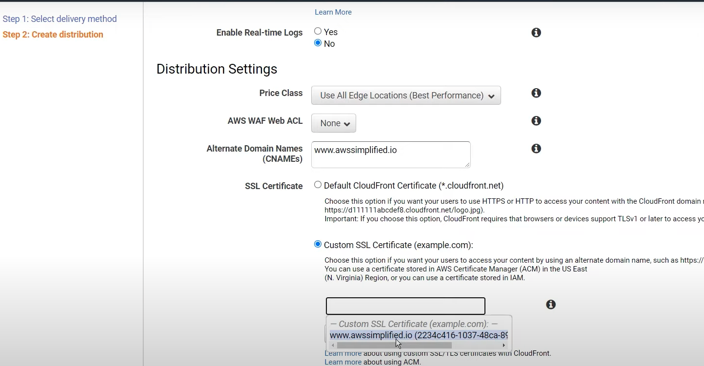
+ after create distribution we can access cfront URL on browser
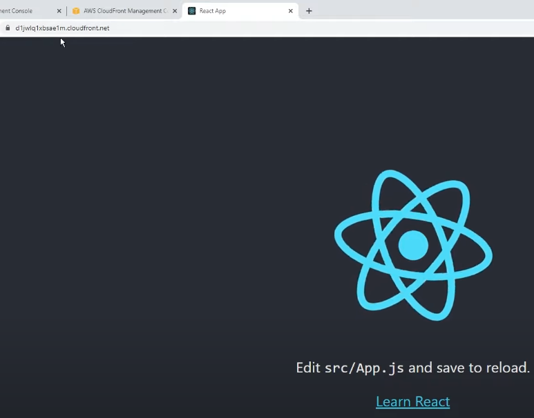

## s3
### `dtqsimplified.io`
+ change protocol from `http` -> `https`

## route53
change route traffic of record `www.dtqsimplified.io` & `dtqsimplified.io` from `s3` -> `cfront` (💣💣)
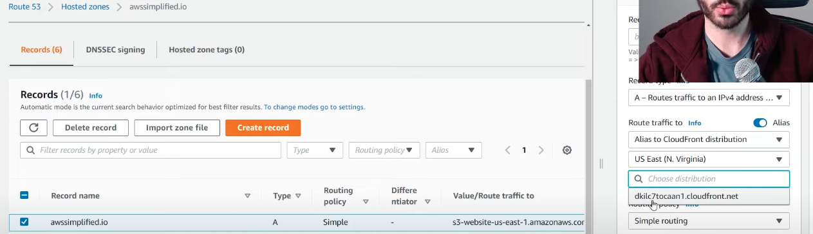

## final result
+ access on browser `www.dtqsimplified.io` will have https + "via cfront"(💣💣)
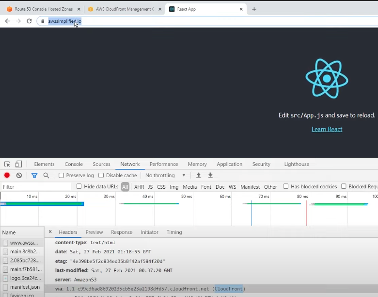
